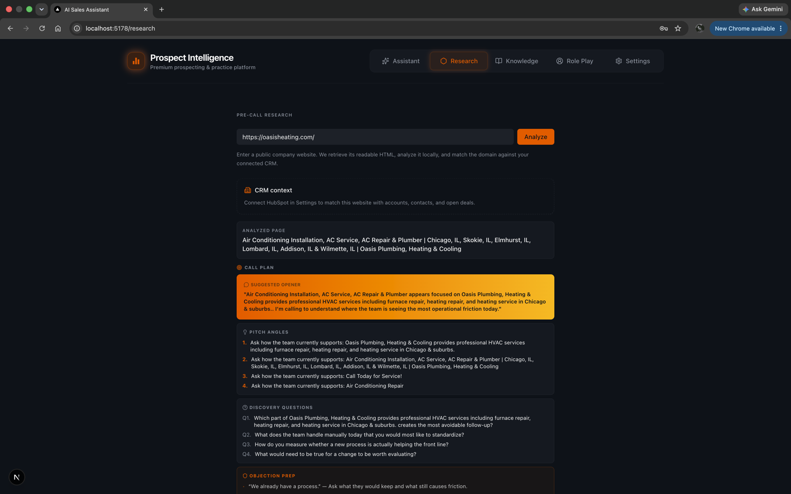
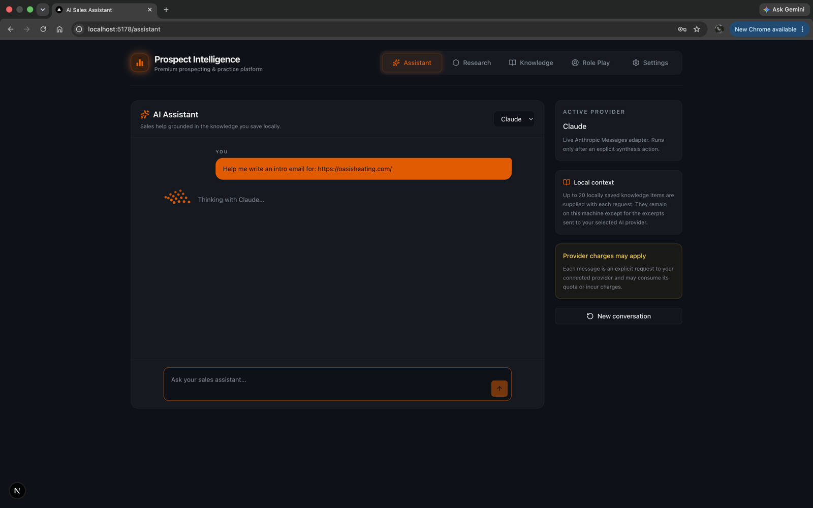
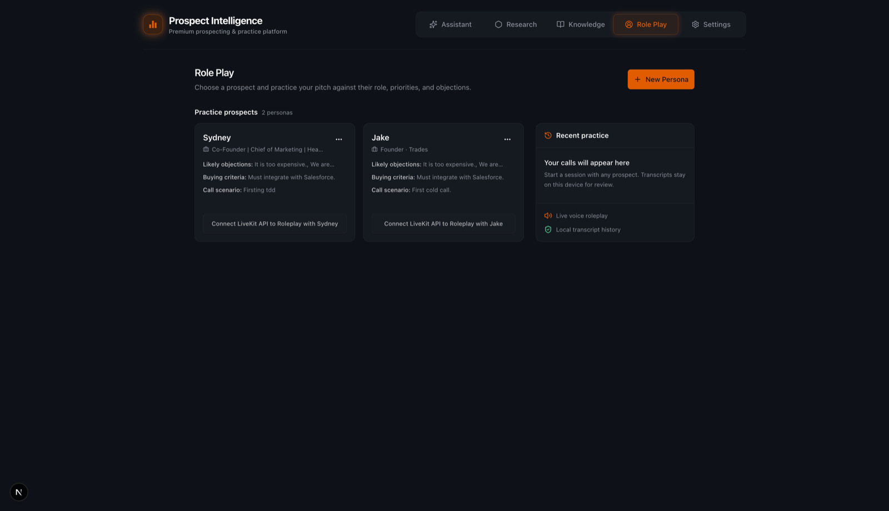
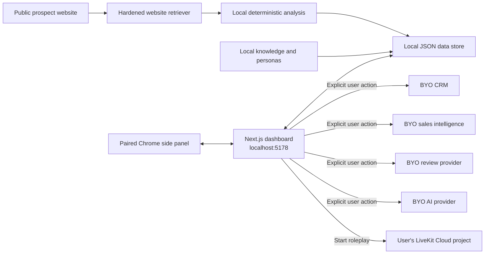

<div align="center">
  

  # Prospect Intelligence

  **Local-first prospect research, sales assistance, and voice roleplay.**

  An open-source, bring-your-own-tools alternative to closed sales-assistance
  platforms—without a hosted account, subscription, or bundled API bill.

  [](https://github.com/Togethr1/prospect-intelligence/actions/workflows/ci.yml)
  [](LICENSE)
  [](SECURITY.md)
</div>

## What it does

Enter a public company website and Prospect Intelligence retrieves and analyzes the
site for you. It turns that source material into practical call preparation, keeps
your working data on your computer, and lets you add your own CRM, enrichment, review,
AI, transcription, and voice accounts when you want more context.

| Workspace | Capabilities |
| --- | --- |
| **Research** | Automatic public-site retrieval, source-grounded company intelligence, customizable output sections, review trends, CRM context, and explicit-run enrichment |
| **Assistant** | Context-aware chat grounded in saved research, local knowledge, personas, and connected-tool results |
| **Knowledge** | Local PDF, Markdown, text, ICP, talk-track, objection, service, and business-context storage |
| **Role Play** | Reusable buyer personas, editable scenarios, objections, buying criteria, voice selection, LiveKit calls, and local transcripts |
| **Chrome extension** | Research the active public page, use the assistant, or receive live coaching from Chrome's side panel |

The free default workflow uses deterministic local analysis and requires no API key.
Optional integrations are disabled until the user connects and explicitly runs them.

## Product tour

### Research a public company website



<table>
  <tr>
    <td width="50%">
      <strong>Context-aware sales assistant</strong><br />
      
    </td>
    <td width="50%">
      <strong>Reusable roleplay personas</strong><br />
      
    </td>
  </tr>
</table>

Screenshots contain public demonstration content and fictional personas. A clean clone
does not include those personas, research records, prompts, or any other runtime data.

## Why this project exists

Sales tooling often makes one of three tradeoffs: manual copy-and-paste research,
another paid data subscription, or sending every piece of context through a hosted
platform. Prospect Intelligence takes a different approach:

- useful local research before any account or key is connected;
- provider choice instead of provider lock-in;
- explicit actions before any potentially metered request;
- no hosted database or project-owned API proxy;
- honest connector states—live, optional, or partner/contract-gated;
- one shared context layer for research, assistance, coaching, and practice.

## Architecture



The dashboard is a local, single-user application. It is not designed to be exposed to
a LAN, deployed as a public web service, or shared between untrusted OS users.

## Security model

Security is treated as a release requirement, not a configuration suggestion:

- The server binds to `localhost:5178` and accepts only exact loopback authorities.
- Provider credentials are encrypted locally with AES-256-GCM and never returned to
  the dashboard client or Chrome extension.
- The extension receives a revocable local pairing token; the dashboard stores only
  its SHA-256 hash.
- Website retrieval blocks private, loopback, metadata, reserved, and special-purpose
  destinations; validates and pins public DNS results; revalidates redirects; and
  limits ports, duration, type, and response size.
- Dashboard and extension routes enforce separate request boundaries.
- Content Security Policy uses per-request nonces. The extension uses Manifest V3 with
  a restrictive CSP and temporary `activeTab` access.
- Uploaded documents, personas, prompts, provider responses, and JSON bodies are
  schema-validated and size-bounded.
- Metered endpoints have in-process request limits and remain locked until the
  relevant provider is connected.
- CI scans the complete Git history with a pinned, checksum-verified Gitleaks binary
  and runs dependency audits, source checks, security regressions, lint, and both
  production builds.

Read the full [security policy](SECURITY.md) and the
[2026 security audit](SECURITY_AUDIT.md) before changing the network or storage model.
No review can guarantee zero future risk; the documentation states the exact threat
model and remaining limitations.

## Quick start

### Requirements

- Node.js 20.9 or newer
- npm
- Chrome or another Chromium browser for the extension

### Dashboard

```bash
git clone https://github.com/Togethr1/prospect-intelligence.git
cd prospect-intelligence
npm ci
npm run dev
```

Open [http://localhost:5178](http://localhost:5178).

Do not change the host binding to `0.0.0.0`. Public or multi-user hosting is outside
this project's security model.

### Chrome extension

```bash
cd extension
npm ci
npm run build
```

Then:

1. Open `chrome://extensions`.
2. Enable **Developer mode**.
3. Select **Load unpacked** and choose `extension/dist`.
4. Pin **Prospect Intelligence** in Chrome.
5. Start the dashboard.
6. Open the extension, request local access, and approve it under
   **Dashboard → Settings → Chrome extension access**.

Clicking the pinned toolbar icon opens the right-side panel directly. The extension
does not inject a permanent launcher into every site or request blanket page access.

## Core workflows

### Research a prospect

1. Open **Research**.
2. Enter a public company website.
3. Select **Analyze**.
4. Customize, reorder, or hide output sections.
5. Optionally run a connected CRM, enrichment, review, or AI provider.

The free Analyze action retrieves readable public pages automatically. It does not ask
the user to paste website content and does not silently run connected providers.

### Build local context

Use **Knowledge** to add business context, services, ICP notes, talk tracks, objection
handling, and supported documents. Research, personas, and knowledge are reused by the
dashboard assistant, extension assistant, Live Coach, and voice roleplay.

### Create a roleplay

1. Connect LiveKit under **Settings → Voice**.
2. Create a prospect persona with a name, title, industry, personality, voice, tone,
   call scenario, objections, and buying criteria.
3. Start a call from **Role Play**.

The bundled local worker creates the temporary LiveKit session. Users do not create or
manage a separate agent. Voice choices are intentionally simplified to man/woman plus
ten plain-language tones.

### Use Live Coach

Live Coach remains locked until an AI provider is connected. After the user starts a
session, it combines transcription with saved research, CRM output, local knowledge,
ICP notes, talk tracks, personas, and objection matches.

Browser Speech requires no separate transcription key but may use Chrome's speech
service. AssemblyAI streaming is optional and metered; its permanent key remains in
the dashboard's encrypted store while the extension receives a short-lived token.

## Integrations

All integrations are bring-your-own-account. Availability, billing, quotas, retention,
and terms belong to the provider.

### Live adapters

| Category | Providers |
| --- | --- |
| **CRM** | HubSpot, Salesforce, Pipedrive, Close, Zoho CRM, Microsoft Dynamics 365, Attio |
| **Sales intelligence** | Apollo, Hunter, ZoomInfo, Seamless.AI, Lusha, Snov.io |
| **Reviews** | Google Places, Outscraper |
| **AI** | Claude, Gemini, OpenAI, Perplexity, Grok |
| **Voice and transcription** | LiveKit Cloud, optional AssemblyAI, Browser Speech |

CRM adapters are read-only and resolve an account using the prospect's normalized
website domain. OAuth access tokens are not refreshed by this local tool; integrations
that use short-lived access tokens must be reconnected after expiry.

### Partner or contract-gated

Clearbit, RocketReach, LinkedIn Sales Navigator, LeadIQ, Clay, 6sense, Bombora,
Demandbase, and G2 are displayed honestly as partner/contract-gated. The project does
not imitate unavailable APIs, scrape logged-in product interfaces, or label a
nonfunctional placeholder as a live connector.

## Cost boundaries

**This repository is free. Third-party usage is not guaranteed to be free.**

- Local website analysis, storage, personas, knowledge, and deterministic matching do
  not require a provider account.
- No provider runs merely because it is connected or visible in customized output.
- Every potentially credit-consuming lookup or AI request requires an explicit action.
- LiveKit, AI, AssemblyAI, Google Places, Outscraper, Seamless.AI, and other providers
  may consume credits or generate charges on the user's account.
- This project has no subscription, hosted proxy, shared API key, or bundled provider
  billing.

Check provider pricing before connecting an account. The software cannot enforce a
third party's free tier.

## Local data

No hosted database is used. Runtime state is created under `data/`:

| Path | Contents |
| --- | --- |
| `data/db.json` | Personas, extracted knowledge, research history, and transcripts |
| `data/credentials.enc.json` | AES-256-GCM encrypted provider credentials |
| `data/.credential-key` | Random device-only encryption key |
| `data/uploads/` | Original uploaded knowledge documents |

Chrome extension preferences live in `chrome.storage.local`.

Runtime files use owner-only permissions and atomic writes. Personas, knowledge,
research, uploads, and transcripts are not encrypted at rest; use full-disk encryption
and a trusted OS account. Back up the entire `data/` directory together because the
credential ciphertext cannot be recovered without its matching key.

The repository itself is a blank slate. A clean clone contains only `data/.gitkeep`:
no keys, credentials, database, uploads, personas, transcripts, knowledge documents,
research records, or generated builds.

## Development

```bash
# Complete mandatory release gate
npm run release:check

# Individual checks
npm run audit:dependencies
npm run security:check
npm run lint
npm test
npm run build
npm --prefix extension run lint
npm --prefix extension run build
```

`npm run audit:dependencies` sends the package names and versions in both lockfiles to
npm's advisory service. It does not send application credentials or local user data.

See [CONTRIBUTING.md](CONTRIBUTING.md) before opening a pull request.

## Known limitations

- Local encrypted credentials and unencrypted working data remain readable to
  malicious software running as the same OS user.
- Loopback binding reduces network exposure but is not user authentication.
- In-memory rate limits reset when the application restarts.
- Browser Speech is not an offline transcription guarantee.
- `activeTab` can read the page the user explicitly activates.
- AI output can be wrong or influenced by malicious page content despite prompt
  boundaries; verify important claims against their cited sources.
- Provider APIs, models, contracts, and pricing can change after a release.
- This architecture is not suitable for public hosting without authentication,
  tenant isolation, managed secrets, durable limits, and a new security review.

## Contributing

Issues and focused pull requests are welcome. Never submit credentials, private
prospect data, customer exports, call recordings, or copyrighted provider datasets.
New paid or metered behavior must remain opt-in and clearly labeled.

## License

[MIT](LICENSE) © 2026 Togethr1 and Prospect Intelligence contributors.
